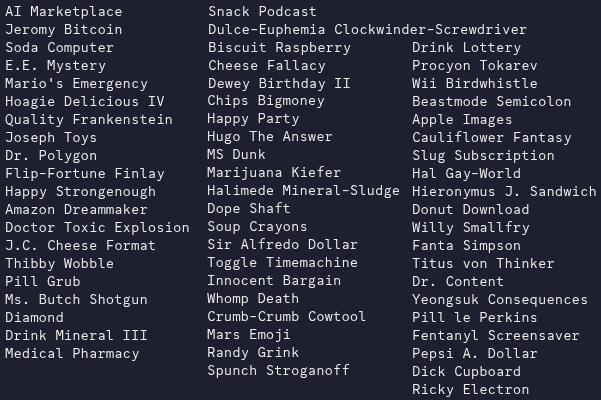

# Naming

{{#template ../../templates/implemented.md}}

Names are randomly generated as part of [character generation](../characters.md) in Ephemeral Space. The algorithm for doing so is much more complicated than upstream, though easy to understand, and all facets of it have a far weirder and more varied dataset.

Names take the basic form of `{prefix} {first name} {last name} {suffix}`. Prefixes can be gendered (Mr. and Ms.) or ungendered (Dr., Professor), and prefixes + suffixes have a random chance to occur. The "first name" can also randomly generate a middle name, a middle initial, a first+middle initial, a quoted nickname, and more. There's a random chance for first names or last names to not generate at all (yes, this means just "Dr." is theoretically a generatable name). 

All individual parts just pull from large unweighted datasets of both gendered and genderless names with a very high chance to pick a genderless name at all times (Space Is Woke Now).

Here's a cherrypicked sample of lovely random names generated using this method:

New name contributions are always, always welcome! It's easy to add them (see [this pr](https://github.com/EphemeralSpace/ephemeral-space/pull/274) for an example, use the `fix_datasets.py` script to aid adding new names to the loc files), and new ones pretty much always make things better as long as they're good and keep a relative balance.

The rest of this doc will go into detail on how first and last names for these datasets were chosen, how to imagine these names in the IC world, categories of names to help you thematically focus, and things to avoid when adding new names.

**Ultimately, when adding new names, the Divine Rule of Comedy applies. If it's funny: go for it, even if it doesn't quite fit in with the guidelines, and especially don't look to the categories as Strict Legislation.**

## The Cultural Landscape

Though we don't really have a strict setting (yet), it's good to place these names in a cultural/thematic context in order to make more interesting decisions both when contributing new names and when roleplaying.

The cultural context vis a vis the current set of names is something like:
- Space in the Year 2XXX is the frontier, borders evaporate and everyone melts together, and previously nonsensical cultural combinations exist everywhere. The previous data set was very heavily Western European--ideally, it is far more expansive of current-Earth culture in all regards.
- With time comes mutation: previously "normal" names are treated as strange, old names are resurrected contextlessly, and popular names undergo weird erosive alterations as a result of cultural-linguistic shift and good old randomness.
- People are much less tied to family with regards to given names and take their own names on purely aesthetic grounds very frequently. Some people do this genuinely, some satirically--in general, people are often aware that their names are Very Strange, and they may have even intended for their names to be Very Strange: don't treat everyone like their name was given to them strictly at birth.
- Surnames exist in a weird space where they are still mostly inherited but can change as part of corporate contracts (the Playstations and Amazons of the world) or through people deliberately obscuring their origins. Some families who entered space deliberately chose to adopt new surnames as a symbolic gesture of their commitment to the New.

## Categories of Names

As mentioned previously: **these are not gospel!** Feel free to add names outside of these categories--there are plenty like that already. This is just a log of some of the broad categories used to arrive at the current list of names. The goal here is simply that thinking in terms of "lets add some new Weirdnormal names" hopefully leads you to a more interesting contribution than just having to think "lets add some new names, I guess" with no specificity.

### "Normal"

Though we want to embrace weirdness, relatively normal names are still a must-have. They ground characters and provide necessary contrast to the weird names of others, as well as other parts of names. Names like "Johnny Playstation" are usually funnier than "Xbox Playstation"! As a general rule, first names should be more normal than last names, which *can* largely be weirder. 

**Example good first names of this category:** "Jerry", "Mikhail", "Violet", "Krishna", "Lee"

**Example good last names of this category:** "Buttersworth", "Vasilyev", "Nguyen", "Campbell", "Watanabe"

### "Weirdnormal"

This is a little bit of a strange concept, but by "weirdnormal" I mean names which could theoretically be perceived as normal if you shift your context to the Space Future and would only be a little out of place in current times. This is quite broad--it can include "normal" names which are mutated in some way, names from fiction which are nonstandard but not that out of place, or entirely constructed names which simply appear phonetically plausible.

**Example good first names of this category:** "Bimmy", "Jilt", "Jeromy", "Thibby", "Urist", "Spunch"

**Example good last names of this category:** "Dugnutt", "Juckport", "Spintwarp", "Clockwinder", "Bifel"

### Celestial

We're in space, so go for space names! These work in-universe because it makes sense why space-seeking individuals might name their kids or themselves after celestial objects, and they're just a lot of fun and usually pretty cool.

**Example good first names of this category:** "Aurora", "Ganymede", "Halimede", "Orion", "Callisto"

**Example good last names of this category:** "Aldebaran", "Centauri", "Persei", "Ceti", "Parallax"

### Brand / Corporate / Cultural

Names which directly reference brands, corporations, or cultural concepts that players would be familiar with. In-universe, you can imagine these in a lot of ways: families/individuals choosing names from media that they feel connected to, corporate sponsorships forcing someone to change their name, people being irony poisoned idiots and naming themselves Dovahkiin Skyrim "For The Bit", etc. These are best used **very sparingly**, because they're way funnier if they're more uncommon. 

Furthermore, which ones are chosen has funny implications for the universe--why is "Sharex" a last name with the same cultural cachet as "Amazon"? What the fuck does that imply about the world? Who knows!

**Example good first names of this category:** "Pepsi", "Lockheed", "Fanta", "Dracula", "Velcro"

**Example good last names of this category:** "Dreammaker", "Amazon", "Playstation", "Whatsapp", "Starwars"

### Technological

Technology is amazing! Individuals felt so connected to beautiful tech like "Databases" that they were compelled to name their kids after it. Imparts a "futuristic" sensibility while still being pretty silly, but sometimes ends up sounding dope as hell.

**Example good first names of this category:** "Sprocket", "Benzene", "Pixel", "Toggle", "Widget"

**Example good last names of this category:** "Podcast", "Email", "Images", "Spreadsheet", "Bitcoin"

### Food

Frankly this is mostly because they're usually funny. Spacemen like food I guess.

**Example good first names of this category:** "Hoagie", "Biscuit", "Cauliflower", "Soup", "Margarine", "Beef"

**Example good last names of this category:** "Dinner", "Blueberry", "Delicious", "Custard", "Macaroni"

### Everyday Items / Concepts

A very broad category! Again, mostly because they're usually really funny and wacky, but you can imagine these as people coming up with false cover names and just using whatever came to mind first if you'd like.

**Example good first names of this category:** "Happy", "Crimes", "Wrench", "Pistol", "Thimble"

**Example good last names of this category:** "Crayons", "Sock", "Explosion", "Toolbelt", "Bottlecap", "Marketplace"

## The No-No's of Names

Again: **not strictly Law!!!** If a name is funny, it can violate these tenets--just don't do it too often. I added fucking `Mario's` and `Luigi's` as first names. Anything can work if its limited.

1) "Normal" names should not be restricted solely to Western European names--varied and interesting names from all cultures should be present.
2) It is not always better to add new names if they are merely aesthetic variations of existing names--e.g. McKenzie vs Mackenzie. Ideally we have some better system for supporting variations in the future.
3) First names should not generally be overly long, and last names should generally not be overly short--obviously very loose and you should expect to break it a lot, but first names should look more like "Fizz" and last names should look more like "Fizzington".
4) Names should never be fully lowercase, nor contain non-ascii characters (really, just anything that would be impossible to type on a regular English keyboard).
5) Random only sometimes equals funny--keysmashing, literally or figuratively, does not make particularly good names.
6) Less is more when it comes to things like branded names or weird guideline-breaking names like "The Answer" or "Mario's". These only work *because* there aren't very many of them.
7) First names & last names should be funny and/or interesting in the context of many other names--names should not be added simply because of a single combination that might happen randomly.
8) Last names that are everyday items/concepts/words etc should generally be nouns rather than adjectives