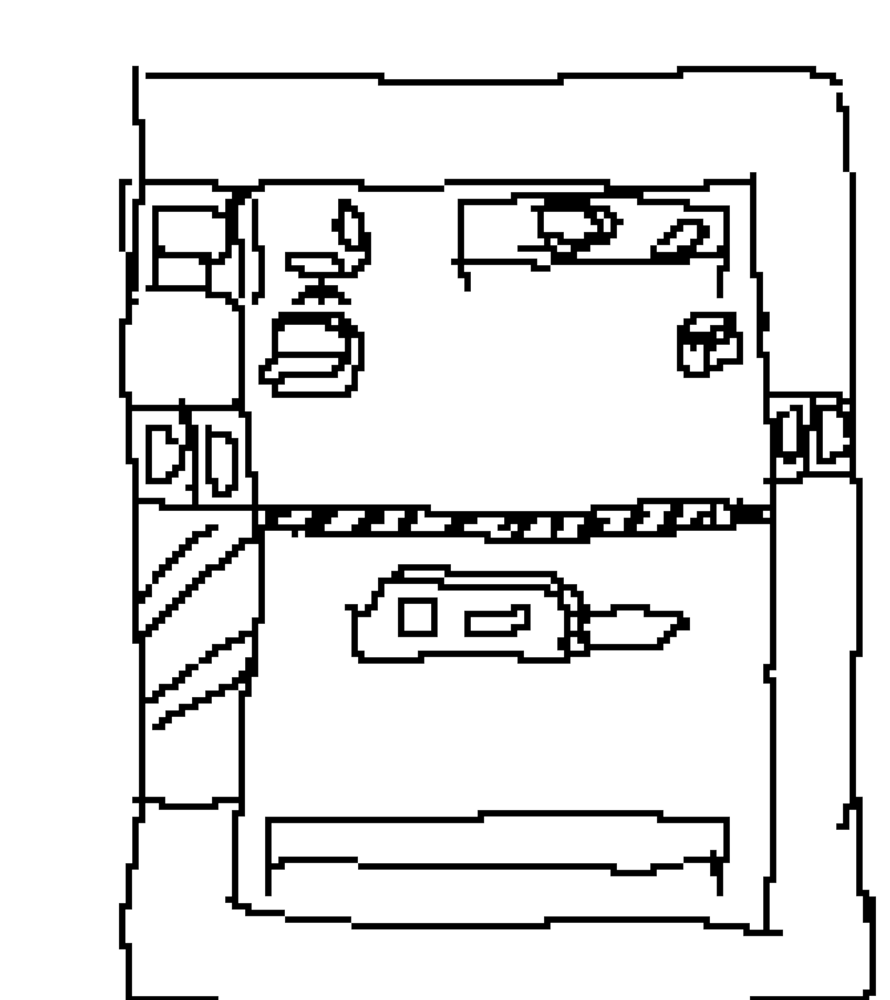

# LATHE (Large semi-Autonomous Tetanus and Heat Emitter)
[TODO fuckass name I just needed something to look at] (and write TODO messages about)

{{#template ../../../../templates/unimplemented.md}}

The lathe is a single Large structure that can't be moved.**It should be the main source of new items to the station.**
Having a solitary source of items makes the lathe and cargo by extension very special; the station is relying on cargo to keep this machine running to have new lights or other components to maintain the station.
Simultaneously, cargo must battle the station degredation on their own front. This applies mounting pressure onto cargo as the round progresses due to the degredation of the station and actions of hostile troupes.

## Heat Regulation
The lathe produces water vapour at scalding temperatures and high pressures.
The lathe should have both a lower and higher temperature/pressure bound on running. The lower bound is to disincentivise spacing the rooms, the upper bound is to add a risk to running for continous lengths of time.
Once the upper bound is exceeded, it should light on fire, spurt out a massive cloud of water vapour (enough to finish off any rusting in the chamber) and take an extra few minutes until it can run again. The lower bound should cause the lathe to freeze up, then release several massive pulses of water vapour in case the pressure release was unintentional; it should have much lower stakes than the upper bound.
The idea behind these are to uh !!EEPY NOTE START AGAIN HERE!!

## Rust
Rust forms on walls, floor tiles, the hull and atmos objects when exposed to water vapour. The water vapour is consumed in this process, the amount consumed depending on the object. Rust should never destroy an object; it should always require an external influence to deal the final blow. This allows degredation in a round to get to the tipping point, and then be nudged over by other random events or the players.
Floor and hull tiles have chances to trip someone over and destroy the tile at higher rust levels. Crew can continually replace the floor if they're paying attention, but in maints where the hull is already directly exposed it creates a minefield in the later ends of rounds.
Rust is removable by welding the afflicted object, which removes 50 points worth of rust per weld. The doafter should be fairly lengthy. [TODO: decide whether to change first step in wall decon or find other soln.]
The arduous removal process is meant to encourage catching rust before it propagates.
The levels are progressed through by consuming a certain number of mols.

### Levels
1 mol absorbed = 1 point (TODO: figure out good numbers for these I picked them out a hat)
10 points - light overlay. max health reduced by 10%.
25 points - medium overlay. maximum health reduced by 25%. Reduced return on destruction/deconstruction. Very low chance to trip. Throughput limited to 4000 L/s.
75 points - heavy overlay. max health reduced by 50%. Rust can spread through this object now. Low chance to trip. Throughput limited to 3000 L/s.
150 points - very heavy overlay. max health reduced by 90%. Walls are vunerable to deltaP. Deconstructed things should crumble into dust and not give any return materials. Medium chance to trip.  Throughput limited to 1500 L/s.
300 points - sprite completely crusted over. 1 max health. Guaranteed trip. Atmos objects completely blocked.

## Mapping stuff
The lathe should be in or near the front of cargo .Simply place a pressure relief valve, set to the lower pressure bound, attached to 2 or 3 passive vents inside the lathe chamber.

