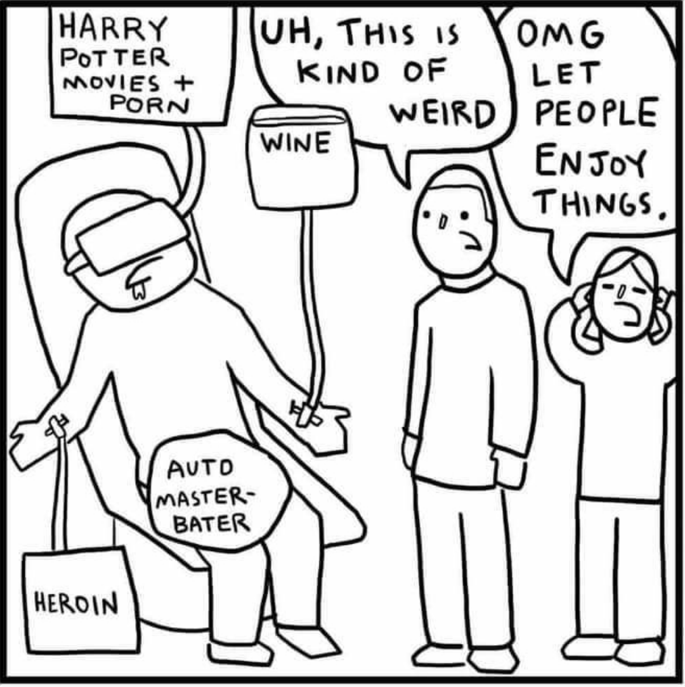

# Operator

- vr headset type item (doesnt block hair)
- has a room with a drone console (there are maybe other drone consoles somewhere else too). room is locked drone console isnt, anyone can use the drone console
- can control the drones remotely. they have less power than a human but still a lot of power. no guns, 1 hand, but can do pretty much anything else. maybe cant talk and has to use beep boops?
- the drones have access to rooms based on which drone it is, but they take a small amount of time to open any door they come across
- drones are spaceproof and are fire resistant but not fireproof
- gets syringes with random narcotics and hallucinogens and shit in them

