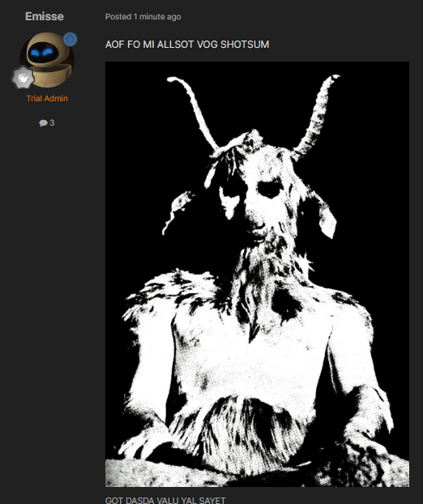

# Martyr

{{#template ../../../templates/implemented.md }}

> **Name:** Martyr
>
> **Troupe:** [Crew](../crew.md)
>
> **Archetypes:** Jester, Murderer
>
> **Description:** Waltz into dangerous situations seeking entrance to Heaven, and give your murderer a short existential crisis before they find Hell.
>
> **Objectives:** Be killed by someone else in your own troupe.
>
> *You HURT and HARM the Blessed Divine Vessel? DEATH! DEATH! DEATH FOR ALL ETERNITY! UNENDING HELLFIRE! RAKED OVER THE COALS! THE STENCH OF BRIMSTONE AND BURNING FLESH!*

## Concept

The Martyr is an exceptionally simple Jester-Murderer type mask, meant to dissuade wanton killing in a very direct way, while creating funny gameplay in the interim period before their murderer dies.

## Abilities

If the Martyr is killed by someone of their own troupe, their murderer will receive a UI quickdialog popup (not just popup text) informing them that they have gone against divine will, and that they will suddenly die, forcibly committing suicide, in 5 minutes.

## Gameplay

The Martyr obviously serves the function of a basic Jester--dissuading unnecessary intra-troupe murder. The gameplay generated by the interim period has a lot of potential to be very funny: scrambling to complete objectives last minute, getting their affairs and relationships in order, maybe going on a last minute grudge spree since they're dying anyway. The "oh fuck" of realizing you just killed the Martyr has the potential to feel absolutely crushing, without being an *immediately* cheesy fuck-you of retaliatory death.

Because the trigger is only on intra-troupe murder, [Traitors](../traitors.md) with objectives to kill the Martyr can rest easy, as it would be a little too cheesy otherwise.

---

