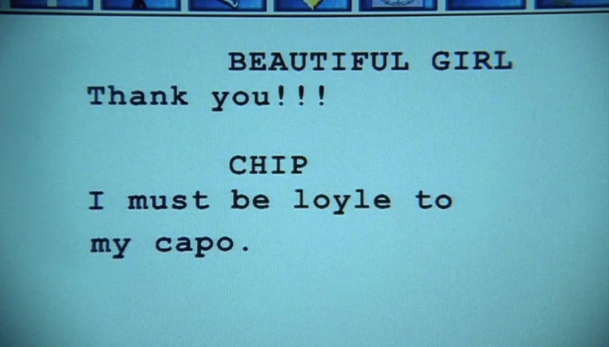

# Mafia

{{#template ../../templates/unimplemented.md }}

The mafia is a **minor troupe** focused on station control, voluntary conversion, and evolution.
It focuses on the [Godfather](), a mask who spawns directly on the station, and the various members of their family, who either came from or will be recruited from the crew.
As a collective, the mafia must take control of station and complete telescience, ensuring that the station (and Don) escape harm.

As a force, the mafia is not immediately harmful to the average person on the station.
The main goal of hijacking the station to bring it under the wider Italian-American control, while causing [crew](crew.md) to lose, is not fatal like other troupes.
Additionally, players can opt to join the mafia (if the Godfather permits them), meaning that they can enjoy a relatively bloodless shift if they play their cards right.

However, if the mafia is defeated, whether by [other troupes](traitors.md) getting a win or just through security and command taking down the organization, all the members of the mafia will lose.
This creates a shifting dynamic, where the mafia can only grow if the crew have confidence in their ability to win, yet the instability of the crew is one that opens up other troupes to win.

```admonish tip "Important Note"
All members of the mafia have the inherent ability to craft a trenchcoat and fedora using cloth.
```

## Base of Operations
The mafia hideout is a dedicated area of the map, consisting of a heavily reinforced set of rooms with blast doors.
It's accessible on the map regardless of the troupes in play, although it will spawn with additional equipment if the mafia is active.

In a mafia round, the Godfather will spawn here instead of the shuttle.
This provides them with some time to gather supplies, fortify themselves, and come up with a plan.
Additionally, once the other mafia members arrive on-station, it also serves as a place for them to organize and store supplies.

The mafia base serves as an ever-present target for security, yet due to the mafia's overwhelming firepower, it shouldn't be taken due to the high risk of casualties.

## Objectives
The mafia has two main goals:
- Seize control of the station
- Have X (low) senior Mafiosos

### Seizing the Station
Control of the station is dictated by the **interspace navigation terminal**, located inside the bridge.
When at this terminal, the Godfather can begin a ~2-minute-long process to reroute it to Italian-American sector space.

The rerouting causes a loud announcement to play, alerting any remaining crew to the situation.
Once the station has rerouted, any non-mafia member can reverse the routing, returning the station back to Nanotrasen control.

### Growing the Family
The Godfather has the option to, at any point, proposition any non-security and non-command player to become a member of the mafia.
Although they can offer this to players with non-crew masks, they are incapable of accepting.
Alongside the offer, the Godfather also selects a target for the member to kill in a show of loyalty.

If the player accepts the offer, they will lose their current mask and become a [goon](mafia/goon.md).
Goons don't count as a senior Mafioso for the purpose of the mafia's objective, although they are still members of the troupe.
Instead, goons have a mask objective to whack the target that the Godfather specified.
When this is completed, the goon's mask will change to a [capo](mafia/capo.md), signifying them as a senior mafioso and progressing the objective.

This creates a progression in the round, as goons kill crew members in order to level up, weakening the crew and drawing heat on the mafia.
This however also limits the pool for future mafia members, potentially starving the mafia if too many members die off.

## Succession

> *The true mafioso understands the value in loyalty...*

In the event that an upper-level member of the mafia (higher than a capo) dies or otherwise loses their mask, there will be a sequence of promotions to replace them.
If multiple people are valid candidates for promotion, one will be chosen at random.

If there isn't a capo to replace a member upon death, the slot will be left empty and the mafia will shrink permanently.
This encourages maintaining a wide base of senior Mafiosos, so that promotions can always happen smoothly and gaps in the organization can be filled.
This also makes the mafia much harder to exterminate, as even if the more obvious and ruthless higher-level members are killed, their more low-key underlings will promote to replace them.
