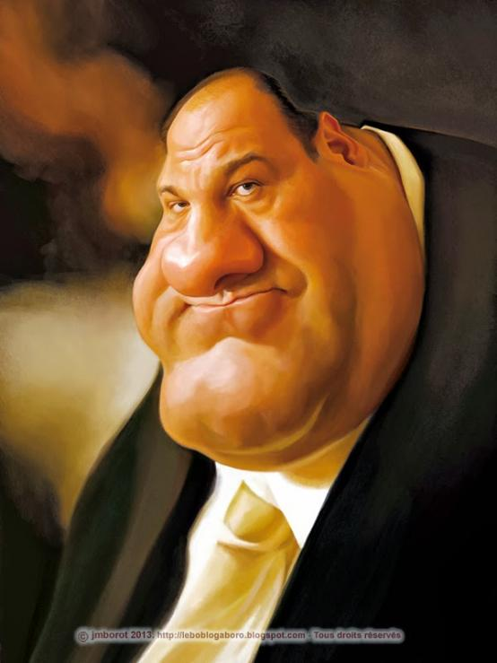

# Godfather

{{#template ../../../templates/unimplemented.md }}

> **Name:** Godfather
>
> **Troupe:** [Mafia](../mafia.md)
>
> **Archetypes:** N/A
>
> **Description:** Run the mafia, recruit new goons, and seize control of the station.
>
> **Objectives:** None.
>
> **Masquerade notes:** Required for the mafia troupe, limited to a single instance per round.
>
> *I'm gonna make him an offer he can't refuse.*

## Concept
The godfather is the centerpiece of the mafia troupe as well as one of the most centralizing figures on the station.
As a key figure in securing a mafia victory, they're well-guarded by their fellow Mafiosos and highly targeted by everyone else.

## Abilities
The godfather spawns directly on-station inside the mafia base instead of inside the arrivals shuttle.
They receive an armored vest and the tommy gun--a unique submachine gun with a high ammo cost that's hard to resupply.

The godfather is also instrumental in completing the mafia troupe objectives, as they are able to induct new members as [goons](goon.md) as well as hijack the navigation console.

If the godfather dies, a new one will be promoted from an [underboss](underboss.md) (or a [consigliere](consigliere.md) if unavailable).

## Gameplay
The godfather is to the mafia troupe what the civilian is to VIP race in TF2C.
Highly important and only moderately less squishy than a crew member thanks to their armor and firepower, they're the most important member of the mafia and the one everyone should be keeping an eye on.
Although they will be replaced in the event of their death, the potential loss of their gear and the dwindling numbers of the mafia makes for a highly unstable situation.

As such, the godfather is best suited to staying inside the base under the supervision of their various subordinates.
Once they've reasonably secured the way for the godfather to seize control, they're able to step out and try to claim victory, hopefully without getting interrupted in the process.

