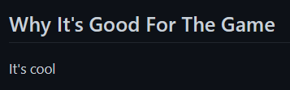
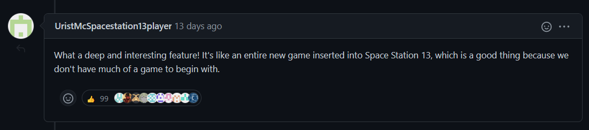

# Mirror's Notes on Design

```admonish warning
This is mostly stream-of-consciousness design musings from one person and is also not finished at all. It's still pretty good though. my oponion. my pinions only
```

It is my strong opinion that in over 20 years, Space Station 13/14 has failed to live up to its true potential in a lot of ways. Though there are promising gameplay elements and features created for larger codebases, as well as exciting forks and gimmick servers, I think many players, contributors, and onlookers can agree that despite the overwhelming amount of content implemented, most servers are fundamentally lacking in their design in very large ways, which tends to reveal itself after spending any significant amount of time with the game. I hope to solve this issue and thus create the first Real Video Game.

This document is partially adapted from a document I (mirrorcult) wrote years ago outlining some of the more egregious design pitfalls I've seen, but in its current form is mostly separate streams-of-consciousness of design wisdom, constructive and deconstructive, that I hope to impart onto people. The concepts here are ones I use regularly when thinking about design, and which I will probably assume some shared primal-abstract understanding of when I'm talking shop with people that have watched me yap incessantly for years.

In this document, when referring to SS13/SS14 as a combined unit, I'll be using the term "SS1X".

On with the show.

## Nerdbait



---

I use the term "Nerdbait" here to refer to features which rely on obscuring their lack of gameplay value using elicited reactions of "it's so cool and complex!" in order to proliferate, which are often a result of them being lifted entirely or in part from other media.

It's fun! It's got funny gadgets! It's Complex :tm:! We've even got some trite `pick(WH40K, Factorio, Dwarf Fortress, Fallout)` references or some shit in here! Don't you just want to play around with it for half a round before being immediately burnt out? What does it bring to the game positively, you ask? I'm not sure, but it makes me rock hard just thinking about how *cool* it is.

It's a fantastic tactic! Genuinely! Loser nerds make up the primary audience of SS13 (that's me), and people love to talk about how *deep* and *complex* and *interesting* the game is. Anything that appeals to that primal desire is bound to get support, even if it's fundamentally worthless as a mechanic. I've been tricked one too many times by the siren's song of "complexity" and this angers me greatly.

The fundamental issue with Nerdbait is mostly that those performing it have failed to understand what makes the game interesting to begin with. Nerdbait is born from mimicry, more than anything: a desire to emulate cool things people have seen done elsewhere without very much interrogation into *why it actually works that way to begin with*.

Now, let's step back a bit. **None of this actually, necessarily, means *for sure* the feature or concept is bad**. There's nothing wrong with prospective features being cool or with taking inspiration from things you enjoy! In fact, I'd dare to say that *the game being cool is pretty cool.* What I'm warning against here is the danger of being easily persuaded towards design that doesn't actually rationally justify itself. A feature's main draw being that it's *cool* just means you should be way more skeptical when dealing with it than you would otherwise.

You might protest--"of course I thought it through rationally, I'm a Good Designer :tm: !". Here the problem gets a little more meta. People are generally pretty bad at introspecting about their actual rationalizations for choices like this. If questioned on "what does this bring to the table?" for design in SS13, people will usually post-hoc invent some rationale about how it fosters interdepartmental cooperation and gives players more choices or whatever and this was the plan all along, but fundamentally, the actual thought process is "..well, it's cool, and cool things are fun, and I like to play with cool features," and then.. "so there must be a rational reason I can find that it's good."

This presents a big issue: nerdbait design ends up being solutions that are desperately looking for problems to justify their addition to the game. Rather than building design rationally out of what issues need to be solved with the game, or what adds new dimensions of gameplay, nerdbait constructs "solutions" in advance and attempts to retrofit them onto the game. "What does this bring to the game?" is a great question for design, but (I would argue) a more important question is "why this solution specifically?" Out of all of design-space, what decisions led you to choose this path? This ends up being far more illuminating with regards to the actual rationale behind things, I think.

That said, again, it's a little hard to blame people for starting with 'cool idea' and building out from there! That's kind of how most design works, especially in a game with a design-space this wide. Problems are often so abstract that it's not very helpful to start from a place of "what can I add to solve this?" So, you'll need some mix of both. When ideas pop in to your head out of the magical aether from which all ideas form, always keep in the back of your mind the question "what am I actually *doing* with this?" from the very start. This way, you can *let it influence your design process as you go*, rather than having to think about all that during the review process after your feature is already done, or worse--never thinking about it at all.

## Videoshames


---

This is a *video game*.

Now, I don't mean this in a "let em have fun, its just a game" sense, though I do also wish people would chill the fuck out sometimes. I mean this in a contrastive sense--this is a *video game* we're designing, not some other medium, like table-top games or a physical sport. When you're designing video games, you have the unique advantage of defining rules and laws through code. That seems obvious to say, but people very frequently miss this fact.

Space Station 13, owing to its history as a BYOND game (an engine initially designed to make graphical MUDs), sits at a somewhat strange confluence between more videogame-y CRPGs and more freeform MUDs or TTRPGs. In a looser environment, without strict code to guide player behavior, moderators (or "game masters") are generally required to ensure that players follow certain baseline expectations, and the first line of enforcement before moderation steps in are arbitrary social expectations beat into people through shame. This isn't a super big issue with low playercounts, especially when the roleplaying group has high internal cohesion, like a TTRPG party. Administration in SS13 is a tradition firmly inherited from this branch, mostly to its detriment. You can emulate the good parts of non-computer games *while* using the medium to your advantage--games like NBA 2K don't require a real person to referee your matches.

I'm not making the claim that administrators are a useless concept in Space Station 13 as it exists or that it would be best to do away with out-of-character rules entirely: it's still quite valuable to excise extremely low effort players and keep a healthy and inclusive community. With how the game is currently designed, lack of administration on major servers would very quickly devolve into hell. The problem doesn't lie with the fact that 'administrators are mean and 1984'--the problem is that *concepts that should be mechanically enforced through design are enforced by more ambiguous social guidelines*. This has a number of strains on all parties involved.

### The strained pains

Moderation teams are now essentially required to be fielded, increasing labor required to run a server. Furthermore, the labor being done can often require a lot of investment to do right--working social situations, getting conflicting info from multiple people at once, log diving, etc. Burnout rates are high, even if in the end they do get to run funny events sometimes (one of the benefits to having game masters in a roleplaying environment).

As for everyone else, the simple fact that language and social guidelines more generally are ambiguous (rules about concepts like 'powergaming' come to mind) leads to a lot of active effort on players part to understand properly what is expected of them, and then even more effort to try and diligently stick to what is accepted. A lot of players will forego engaging in 'ambiguous' situations like with escalation rules to avoid having to deal with moderation at all, which makes the game much less interesting--people pull their punches.

### Moving forward

So, okay: solutions. What do we do about this? A lot of people would say "we need the rules, people would just RDM/powergame/grief and it'd be anarchy", and, okay, as I've said, this is true of the current state of most servers to a certain degree. But, come on, it's not a *desirable* state of affairs: we have the power in most cases to mechanically enforce things. You should treat almost every issue that administration has to deal with as a problem with game design, because most of the time *it is*. Other multiplayer videogames don't have to do this!

Of course, it's not always as simple as the screenshot above, where the obvious solution would be to mechanically gate character customization based on the species you have selected. Questions like 'how do we design around and prevent "powergaming" through mechanics?' have less simple answers, and I'm not going to outline a perfect path to a solution for you here (though the rest of this document does exist for a reason). Just keep in mind that *these are questions you should be asking!* Leaving things strictly to administration puts unnecessary burden on your moderators and disrespects your playerbase.

## Simulate, Integrate, Emerge

In game design, more and more people are noticing and deliberately implementing a kind of "systems-based design" (or [systemic](https://youtu.be/SnpAAX9CkIc) design). The goals with this kind of design is to use interlocking game systems interacting in novel ways to create emergent gameplay and [tell stories](https://www.youtube.com/watch?v=NyMndWpihTM). Rather than top-down designing everything that can occur, you build systems from the ground up, vary initial conditions, give players tons of choice, and let the chaotic dynamics play out (both in the mathematical sensitive-dependence-upon-initial-conditions way and the colloquial 'funny chaos' way).

There is a treasure trove of incredible games in this tradition--immersive sims like Deus Ex or Dishonored, story-generators like Dwarf Fortress and Rimworld, and roguelikes who take heavy advantage of variance like Noita, CDDA, or Caves of Qud. In my humble opinion, this tradition is the main one to follow when considering high-level design of Space Station 13. Some people already intuitively recognize this--I sometimes hear it called "multiplayer Dwarf Fortress in space", and the player overlap between these games is very high.

When I talk about "integrating systems" here, and you're familiar with SS13 design discussions, I want you to *completely forget the SS13 concept of "interdepartmental cooperation" or anything similar* when thinking this stuff through. Better yet, temporarily forget that "jobs" or "departments" exist *at all* and think in strictly decentralized terms with regards to mechanics. 

The reason for this is simple: thinking of gameplay mechanics in terms of individual boxes you can put them in and "have someone do" is completely antithetical to creating the types of chaotic webs of complexity that drive emergence.

### The how

Systems are "integrated" through their interactions and dependencies on eachother. In *Breath of the Wild*, the materials system, weather system, and elemental system all interact--wearing metal items can conduct lightning to you during thunderstorms. In general, the more of these little interactions there are and the more intuitive they are, the better. 

The easiest way to do that is generally to simulate some level of detail about objects--their material composition, weight, shape, physical properties like flammability or brittleness, melting point, etc. Space Station 13 does this to some degree, occasionally, but not to the gold standard of games like CDDA or Dwarf Fortress. Once you've got all these base things thought up, all it takes is a little creativity to figure out novel ways for the game to work with itself.

Of course, a "simulationist" approach to integrating gameplay is not the only one you should use. When thinking about integrating different areas of gameplay, think of each area as a new "dimension" of design-space and picture how this dimension extends and intersects with everything that already existed. In this way, you might want to ensure that a dimension of gameplay like "movement" has adequate intersections with many other systems--movement speed can be modified by many things, movement can allow you to interact with certain objects, lack of movement can provide contrast and meaning to mechanics. By compartmentalizing systems in this way and picturing their intersections, you can even "discover" new types of gameplay just by imagining the ways two different systems could intersect and making it so. Designer-side emergence!

### The why

Integrated systems in general are very satisfying to interact with on a gameplay level. They make the game feel cohesive, and when intuitive allow the player to perform natural experiments and see their results--players might notice that temperature and cooking are connected, and intuit that "perhaps lighitng a fire and throwing raw meat in will cook the meat". These types of interactions introduce incredible amounts of depth to gameplay and allow for unique scenarios so bizarre and intricate that you remember them for years.

Simulationism does sometimes invite the response of "we don't need realism--it doesn't make things interesting by default". I think this is looking at things the wrong way. You **should** want mechanics to generally align with reality (simulation), because *reality is completely emergent from a set of simple integrated rules.* That might seem a little abstract, but all I mean is that basing interactions on what happens in reality is a good heuristic to get something that works in interesting ways. Plus, people generally already have a basic understanding of reality, so it's intuitive!

I think what people really mean when they decry "realism" is that it's *really* easy (especially if you're getting Nerdbaited) to get bogged down in high levels of complexity for simulation that has extreme diminishing returns, and I agree with this completely. You should think a lot about the level of abstraction you're going for with simulation, and be careful not to go deeper than you need to. You don't need to simulate valence shell interactions to make interesting chemistry mechanics, and you don't need to simulate electronic circuits to make interesting computer mechanics. 

Note that, in my opinion, simulation doesn't stop science-fictioney or fantasy aspects of the game from existing. In fact, a lot of these more speculative mechanics work better when laid on top of a groundwork of systems based in reality.

### The what

What does an 'integrated' environment look like compared to a relatively 'unintegrated' one?

Unintegrated environments are static, uninteractive, seem more like set dressing than objects in a real world, but generally require little real effort to actually create. However, they often incur more maintenance effort, due to the need to hardcode interactions more often than letting them emerge naturally.

Integrated environments are far more dynamic, immersive, and have many options for players and possible scenarios that can be created. Players existing in them have a rough idea of what's possible, just based on intuition (and some basic game knowledge). Very strange and fun gameplay situations can emerge out of relatively simple interactions occurring, because almost everything is connected in some way.

## Design by Mob Rule


*just, in general*

---

Understanding the contribution structure of SS13 is really, really important to understanding why it is the way it is, and how to move forward while keeping the things we like about that system.

SS13 is, easily, the largest open source ecosystem for a game. Even big FOSS games like CDDA don't have nearly the same type of forkability as SS13, where the ability for individual servers to host their own code has inspired dozens of people to try their hand at doing it better than everyone else before them.

This is, undoubtedly, a good thing about the game. The ability for the players of the game to easily contribute design and gameplay has led to one of the most unique games ever made, and I'm very glad that codebases with this structure exist. That said, it would be quite dumb to say that it has had no downsides.

### Armchair design

The obvious one--playing a game doesn't really mean you know jack shit about what makes it good, or how to add new good things. Being in any game community ever, especially for live-service games like MMOs, you'll find "armchair designers" convinced that it's the easiest thing in the world and that they can do better than triple-A studios (okay, well, sometimes they can) with professional designers.

Imagine a game that *was* exclusively ran by those armchair designers. One shudders at the thought, and yet here we are, two layers deep, because I'm armchair counter-designing right fucking now! Of course, this analogy isn't a perfect mapping: most armchair designers in other games don't have intimate access to the source code or the design history of the game they're working with, so we do have a leg up here, and we *can* get it right. After all, everyone is an "armchair designer" before they make an indie hit. Point is, it should be clear that it's way easier for player-contributors to get stuff *wrong* under this system. That is, after all, why I made this document.

### Game vision

The "mob rule" contribution structure, where anyone can give feedback or make contributions and maintainers generally have free reign to merge things without actual consensus, leads to a lot of problems with game vision. Even in scenarios with a very opinionated lead-designer trying to sign off on every PR, stuff can slip through, and you still have to work on top of everything else that's already been added to the game, and expectations from rabid players about what will remain in the game.

It's hard to have a cohesive design view of such a vast game to begin with, but even harder when one person almost never has enough control or manpower to shape it to their will. As a result, features are often added independently of one another without much thought to overall integration. Even worse, when anyone can choose to code anything at any time and submit it as a pull request, there's a lot of pressure on maintainers to try and get 3,000 line design-behemoth beastures (beastly features) into something workable and just merge it rather than reject it outright, due to any combination of sunk-cost on their part with reviews and design arguments, a desire to not upset the contributor who spent so much time and effort coding it, or a desire to not upset the playerbase which has infinite eyes on all new pull requests and wants their shiny toys.

This pressure exists for contributors in the other direction--people who want to add or rework features that are perhaps controversial but which maintainers feel would be valuable nonetheless, or people who bravely try to remove dead-in-the-water features from the game to make everything more cohesive, are very often lambasted and even threatened at times by players who have formed an emotional attachment to whatever is being upended. This atmosphere helped to invent the prevalent hostile dichotomy between "the code jannies who hate fun" on one side and "the gigachad players who love fun" on the other, which isn't particularly helpful for anyone. It's becoming increasingly common for contributors who wish to make bold design decisions to submit PRs using a shared account or fake username to avoid receiving cum in their mailbox.

I would call this phenomenon **cruft inertia**: the tendency for shitty, unintegrated systems to stay in the game simply because no one cares enough to invite the reactionary backlash that trying to improve things would bring, or because no one even bothers to question things that have "always been like that".

### Everyone does it for free

This matters a lot when it comes to contributions to a game that is as long-running as SS13: sometimes people just don't want to do it anymore, and they stop. Or, they get a job, and they have to stop--or they get in a relationship that takes up too much time, or they go to jail for tax evasion and don't get a computer with an IDE installed, or *whatever*.

A lot of features are *huge* and require months or years of incremental improvement and maintenance to stay relevant and well-integrated, and when no one's getting paid that's really hard to keep promises about. Clockcult is maybe the saddest example of this I can think of: it started out as this grand vision with intense lore and design, slowly petering out until it got to the point where no one left cared about it anymore and it was removed from most servers. If the game was designed more deliberately from the top-down, with less dead-end features to maintain and a better vision of what will stay along with increased buy-in from designers, this might be less of an issue.

If you want to mitigate this, you **need to reduce scope as much as possible** and you **NEED to empower your designers with real artistic control**. Reducing scope can mean a lot of things--not bikeshedding microbalance, removing features which incur massive design debt for no benefit, freezes, compartmentalizing design when possible to avoid having to change Everything when one aspect changes, reducing mapcount or the amount of fluff items to reduce designer burden when adding new dimensions of gameplay, etc. Empowering designers means you just need to trust people that have a vision, and give them the power to actually enact it. This is a bit abstract and difficult for all the usual reasons development politicking is difficult, but it's necessary if you want an experience that actually feels coherent and soulful.

## Plato's Allegory of the Gooncave



---

If there's one thing I would like to hammer home above anything else, it's that, inherently, SS13 is a multiplayer game to its core. This is a fact that should be key to the design process, above almost all other considerations. If you're designing a feature, and you find that it plays exactly the same in a singleplayer test environment as it does in a multiplayer one, you are doing something horribly wrong.

The multiplayer aspect of the game is this important because it introduces the inherent volatility and variance that comes along with being human and with social dynamics. This aspect of the game, I would argue, is why people keep coming back to SS13 despite its many design failures: people make it fun anyway. Nobody ever shared an engaging story about SS13 that didn't involve a single other player in some capacity.

With everything positive that I'll talk about later, the multiplayer aspect of the game interfaces with it in ways that you should cultivate through design as much as possible. You shouldn't rely on multiplayer to carry the game (that is: for players to "make their own fun" through gimmicks or otherwise), you should be working with it as much as possible.

Yet, so often, especially when it comes to job design, Space Station 13 runs antithetical to this point. The geneticist / virologist / xenobiologist roles on most servers exemplify this well. Not only are they essentially 'loner' jobs by design, made to sit in a sterile box and press buttons all shift long until they suicide, but their actions rarely affect other players even indirectly except during end-of-round grief! Clearly something has gone terribly wrong here.

wip

## Myths and Methods of Balance

"Balance" is a funny concept, especially in a game so strange as this. Most people conceptualize balance as RPG-style number-tweaking–damage goes from 15 to 10, range goes from 2 to 1, now it's balanced. Of course, this is an abstraction over "real balance" only useful for a subset of games. "Real balance" is more of an undefinable arbitrary-intuitive-game-feel thing. Balance is up to the population of players and how "balanced" they feel the game is.

Let's step back for a second, because, come on, the main objective of a game isn't for its minutiae to be balanced, it's for it to be fun to play. Balance is an abstraction: the purpose of thinking in terms of it is that players will usually enjoy the game more if they feel like their choices matter, or that they have many options at their disposal. That makes it a generally pretty useful abstraction, but always keep in mind what you're actually shooting for here.

### The balance you can't see

Is balance really about symmetry?–-for example, a literal physically balanced scale where both sides are perfectly equivalent numerically in weight? The mapping here to games might be an adversarial player-vs-player game where each side has an exact 50% chance of winning: perfectly balanced, eureka! Though, as is obvious, this isn't really a useful metric in fundamentally asymmetric games, games without a "win condition", or games with mechanics quite literally too complex to think about holistically. So, designers try to create "symmetry" in more specific places–-damage numbers or weapon power, item prices in in-game economies, that sort of thing.

This is the popular conception of "balance" in its totality. The problem with this is that there are ways to balance the game that aren't immediately obvious. People are biased towards the numbers they can see and understand: health, mana, damage, Overpowered or underpowered as contrasted with what? What issues does the "incorrect" power level bring that lower the enjoyment of the game?

wip

## Fully Automated Luxury Sandbox

wip

## Sisyphean Projectslop

wip

## Bunny Planet


omg..