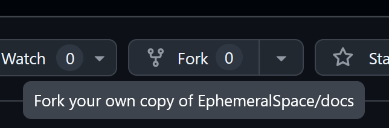
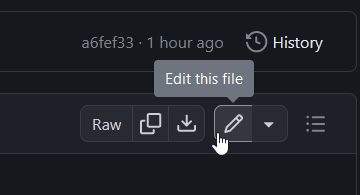
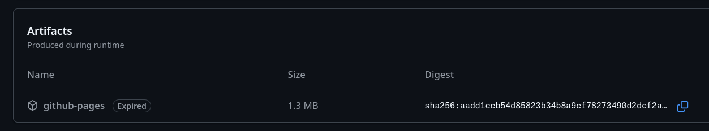

# Guide to Editing Docs

Hello! As you may be able to notice, this docs site is completely open source and free to edit on GitHub. You can see the GitHub page for this site at [https://github.com/EphemeralSpace/docs](https://github.com/EphemeralSpace/docs).

Keep in mind that while web-edit PRs (those made through the GitHub web UI) are not allowed on the main Ephemeral Space Repo, this is not the case here.

## Style

Documentation should be written in a [technical communications style](https://ohiostate.pressbooks.pub/feptechcomm/chapter/3-writing-style/). Effective technical communications are [concise, precise, direct, and well organized](https://ohiostate.pressbooks.pub/feptechcomm/chapter/3-writing-style/) and should be written in an appropriate [voice and tone](https://ohiostate.pressbooks.pub/feptechcomm/chapter/3-1-voice-tone/) using [correct mechanics and grammar](https://ohiostate.pressbooks.pub/feptechcomm/chapter/3-2-mechanics-grammar/), citing relevant sources where needed.

## Making basic edits

If you just want to make a basic edit of a page, simply follow these steps--you don't need any of the fancy stuff talked about later:

1. Create an account on GitHub, or log in if you already have one.

2. Fork the [EphemeralSpace/docs](https://github.com/EphemeralSpace/docs) repo on GitHub.

3. Find the file corresponding to the page you want to edit on the documentation repository.

4. Click the 'Edit this file' button at the top right of the file view.

5. Make your changes, then commit & create a pull request! We'll handle the rest.

## Building

If you want to locally build the docs, the necessary dependencies are Rust and some binaries installed using `cargo`. It's recommended that you use `cargo install` or `cargo quickinstall`, as building can take a while.

From cargo, install:
- `mdbook`
- `mdbook-pagetoc`
- `mdbook-admonish`
- `mdbook-linkcheck`
- `mdbook-template`

Alternatively, this repo supports nix flakes. If you have nix installed, you can run `nix develop github:EphemeralSpace/docs` to enter a dev shell with all necessary binaries, or just run `nix develop` in the main directory if you have it cloned.

Run `mdbook serve` to build and locally host the documentation from the `book` directory at `localhost:3000`.

## Testing changes

If you've made a PR, the easiest way to test your changes, since they're just markdown, is to view them in GitHub's own markdown viewer in the `Files changed` tab. You can also use a local markdown previewer extension for something like [VSCode](https://marketplace.visualstudio.com/items?itemName=shd101wyy.markdown-preview-enhanced).

If you want a slightly more authentic experience, every PR will have the `Test mdBook Build & Upload Artifact` action run, and you can download the built site like so (it wont be expired if its recent I just didn't want to bother running another action):

Then, just unzip it and open `index.html`. Our custom CSS and stuff won't work super well but it'll look good enough.

For an authentic-authentic experience, just follow the build instructions above and run `mdbook serve` like normal.

## Review

Maintainers will review pull requests for documentation for content and [style](#style). Maintainers understand that many contributors do not speak English as a native language and will be helpful with their review comments.

To help make best use of maintainers' review time, before submitting please:

- Proofread your changes
- Use a spell checker
- Consider using grammar review tools like [Grammarly](https://www.grammarly.com/)

## Organization

When writing design documentation, the folder organization and layout in SUMMARY.md (what shows up in the sidebar) are very important for making things easy to parse.

Here's how things are currently organized in the design section, and how they should ideally stay organized for the future:
- Meta-information about design -- design pillars, tips on how to reason about design, terminology, etc should always be at the top of the section and visually separate from more meaty documentation.
- Core documentation, which will always be relevant irrespective of gamemode and mostly touches on foundational mechanical things like interaction or simulationist elements of the game, should be the next section
- More specific 'feature' documentation, which may consist of describing a mechanic and enumerating the different elements of it like events, masks or jobs, should be in a different section and below core mechanical design.
- When ordering within a section, place pages with lots of subpages first, and sort alphabetically after that. Small sections can be ordered in specific ways if it makes sense, but if you can't think of an obvious way, just follow that.
- Subpages of a page should always be in a new folder named after the top-level page. The top-level page should not reside in this folder.
- **Avoid creating more layers of nesting than necessary**. If you need to delineate two different 'sections' of design, as is done right now, just use a section delineator in the SUMMARY.md layout itself.